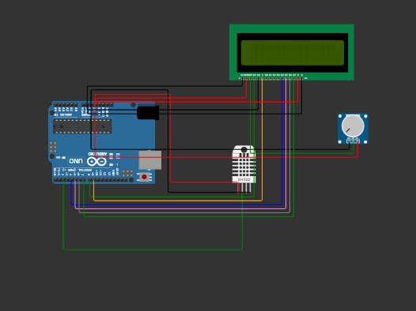

Este proyecto utiliza un Arduino junto con un sensor de temperatura y humedad DHT11 para mostrar los valores en un display LCD 16x2. El sistema actualiza las mediciones cada 2 segundos y maneja errores de lectura del sensor.

## Componentes Necesarios
- Arduino (Uno, Mega, Nano, etc.)
- Pantalla LCD 16x2 con interfaz paralela
- Sensor DHT11
- Potenciómetro (para ajustar el contraste del LCD)
- Resistencias y cables de conexión

## Conexión del Hardware

| Componente | Pin en Arduino |
|------------|---------------|
| LCD RS     | 8             |
| LCD E      | 9             |
| LCD D4     | 4             |
| LCD D5     | 5             |
| LCD D6     | 6             |
| LCD D7     | 7             |
| DHT11 Data | 2             |

## Instalación y Uso
1. Clona este repositorio o descarga el archivo.
2. Asegúrate de tener instaladas las siguientes bibliotecas en el IDE de Arduino:
   - `LiquidCrystal`
   - `DHT` (de Adafruit)
3. Conecta los componentes según la tabla de conexiones.
4. Sube el código al Arduino.
5. Observa los valores en la pantalla LCD.

## Código
El código realiza las siguientes funciones:
- Inicializa la pantalla LCD y el sensor DHT11.
- Muestra mensajes de inicio en la pantalla.
- Captura los valores de temperatura y humedad cada 2 segundos.
- Maneja posibles errores de lectura del sensor.

## Funcionamiento
- Si el sensor está funcionando correctamente, se mostrarán los valores de temperatura y humedad en la pantalla LCD.
- Si hay un error en la lectura, la pantalla mostrará "Error sensor" por 2 segundos y luego intentará nuevamente.

## Capturas de Pantalla

